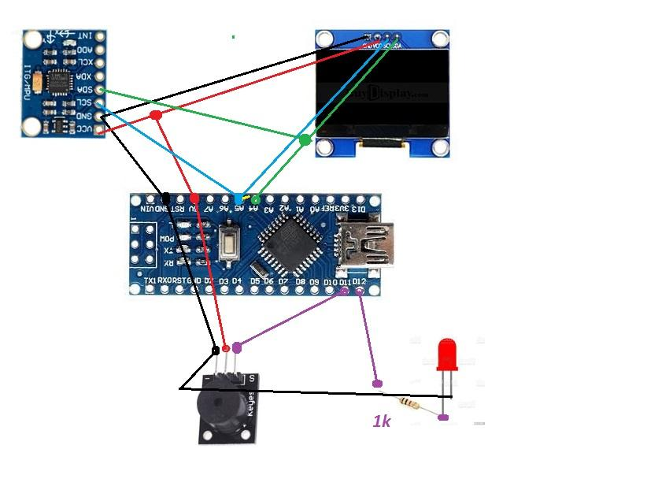
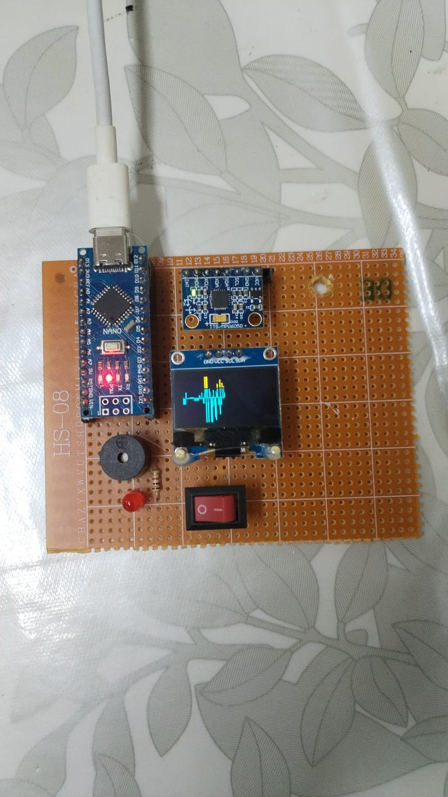
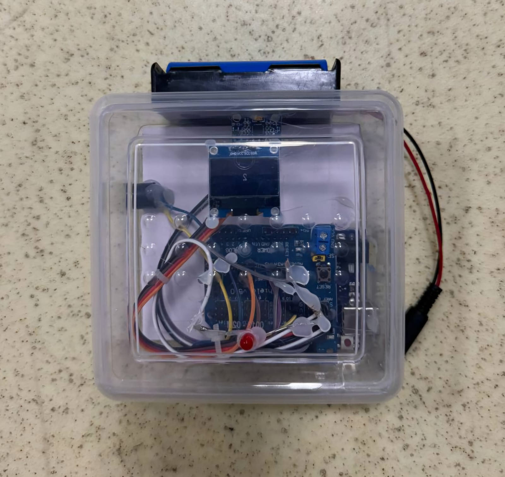
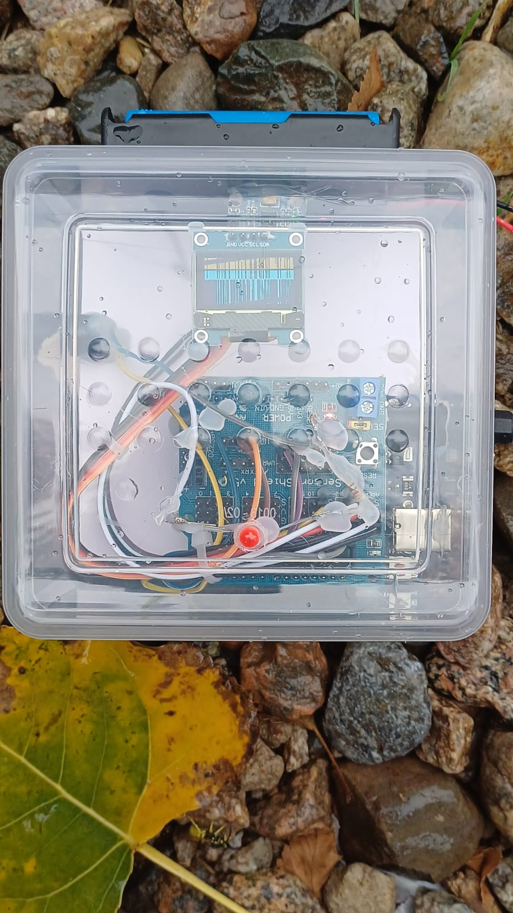
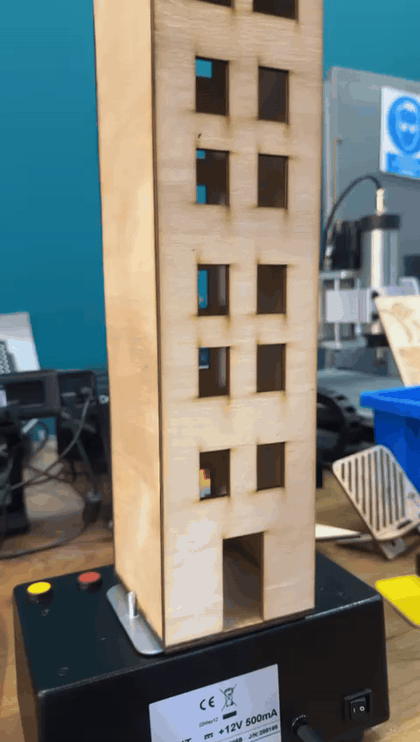
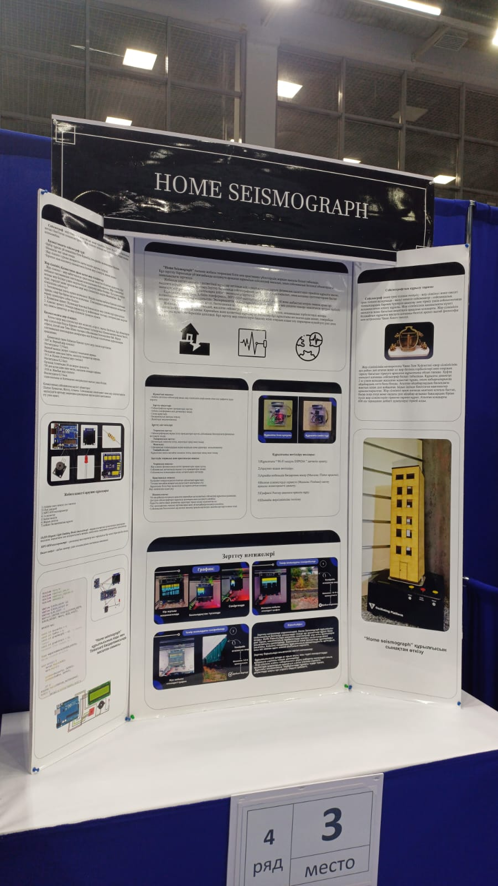
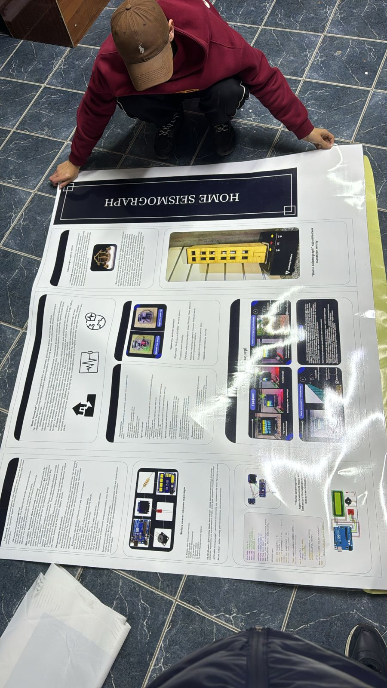

# Project HomeSeismograph (with Arduino)

**Project HomeSeismograph** is a low-cost Arduino-based seismic vibration detector designed to monitor vibrations and display real-time signal changes on an OLED screen. The project was developed as a school research and engineering project for the **RKNP competition among NIS schools**.

The system uses an **MPU6050 accelerometer/gyroscope** to detect vibration, an **OLED display** to visualize live signal data, and a **buzzer + LED** to alert when vibration exceeds a selected threshold.

> Authors: **Islam Yekiya** and **Nurtas Nazarbayev**  
> School: **Nazarbayev Intellectual School of Physics and Mathematics in Shymkent**

---

## Project overview

The main goal of this project was to create a compact home seismograph prototype that can:

- detect physical vibrations using an MPU6050 sensor;
- calculate the vibration intensity from acceleration data;
- show the live signal on a 0.96-inch OLED display;
- activate a buzzer and red LED when vibration exceeds the threshold;
- be tested in real-world vibration conditions, including railway vibration from a safe distance.

---

## How it works

```text
MPU6050 sensor
      ↓
Arduino reads X, Y, Z acceleration
      ↓
Arduino calculates vibration intensity
      ↓
OLED displays live graph and magnitude value
      ↓
If magnitude >= threshold:
      LED turns on + buzzer alarm starts
```

The displayed value is not an official earthquake magnitude scale. It is a **relative vibration index** calculated from MPU6050 acceleration changes. This made the prototype suitable for comparing vibration levels during demonstrations and field testing.

---

## Prototypes

### Prototype 1 — Arduino Nano version

The first prototype used an **Arduino Nano**, MPU6050, OLED display, buzzer, LED, and a resistor. This version was built on a perfboard and used for early testing of the sensor logic and display output.

<p align="center">
   
   
</p>

### Prototype 2 — Arduino Uno + Shield version

The second prototype was redesigned using an **Arduino Uno** with an **Arduino Sensor Shield**. The shield made the wiring cleaner and more reliable for exhibition and competition use. The main components remained the same: OLED display, MPU6050, buzzer, and LED.



---

## Field testing

The device was tested near a railway area from approximately **2 meters away** to observe how passing trains affect vibration readings. The test helped demonstrate that the device can detect real environmental vibration sources, not only manually generated shaking.

<p align="center">
  
   
</p>

> Safety note: the test was performed from a distance and should not be repeated near active railway tracks without proper adult supervision and safety clearance.

---

## Presentation demo: moving house model

For the project presentation, we also built a small moving house model to demonstrate how the HomeSeismograph reacts to vibration.  
The model helped explain the working principle visually: when the house shakes, the MPU6050 sensor detects acceleration changes, the OLED displays the vibration signal, and the buzzer/LED alert system is activated if the vibration level exceeds the threshold.

<p align="center">
  
</p>

<p align="center">
  <em>Moving house model used during the project presentation to simulate vibration and demonstrate the seismograph response.</em>
</p>

## Competition history

The project was presented at the **RKNP competition among NIS schools**.

| Stage | Location | Result |
|---|---:|---|
| School/inter-school selection | Shymkent | Advanced to the next stage |
| City/intercity stage | Karaganda | **2nd place** |
| Republican stage | Aktobe | Participated, no prize place |

The project received **2nd place** at the Karaganda stage and qualified for the republican stage in Aktobe.

<p align="center">
  
</p>

---

## Exhibition stand

For the republican stage in Aktobe, the project was presented with a full research stand explaining the problem, hardware, circuit, algorithm, testing process, and results.

<p align="center">
  
  
</p>
The poster was also prepared and printed before the competition presentation.


---

## Hardware components

| Component | Purpose |
|---|---|
| Arduino Nano | Main controller for Prototype 1 |
| Arduino Uno | Main controller for Prototype 2 |
| Arduino Sensor Shield | Cleaner wiring and easier connection for Prototype 2 |
| MPU6050 accelerometer/gyroscope | Detects vibration and acceleration changes |
| 0.96-inch I2C OLED display | Displays live vibration graph and value |
| Buzzer | Sound alert when threshold is exceeded |
| Red LED | Visual alert indicator |
| Resistor | Current limiting for LED |
| Power switch | Turns the prototype on/off |

---

## Wiring summary

Both the OLED display and MPU6050 use the I2C bus.

| Module | Arduino Nano / Uno pin |
|---|---|
| OLED VCC | 5V |
| OLED GND | GND |
| OLED SDA | A4 / SDA |
| OLED SCL | A5 / SCL |
| MPU6050 VCC | 5V |
| MPU6050 GND | GND |
| MPU6050 SDA | A4 / SDA |
| MPU6050 SCL | A5 / SCL |
| Buzzer + | D11 |
| Buzzer - | GND |
| LED + | D12 through resistor |
| LED - | GND |

> Pin numbers can be changed in the Arduino code if your wiring is different.

---

## Software

The Arduino sketch is located here:

```text
code/HomeSeismograph/HomeSeismograph.ino
```

Required Arduino libraries:

- `Adafruit MPU6050`
- `Adafruit Unified Sensor`
- `Adafruit SSD1306`
- `Adafruit GFX Library`

Install them through **Arduino IDE → Library Manager**.

---

## Demo video

A demo video can be added here:

```md
[Watch the demo video](PASTE_YOUR_VIDEO_LINK_HERE)
```

Recommended: upload the video to YouTube and place the link above. For GitHub, it is better to avoid uploading very large video files directly to the repository.

---

## Repository structure

```text
Project-HomeSeismograph-with-Arduino/
├── README.md
├── code/
│   └── HomeSeismograph/
│       └── HomeSeismograph.ino
├── docs/
│   ├── wiring.md
│   └── competition-history.md
├── images/
│   ├── prototype-1/
│   ├── prototype-2/
│   ├── testing/
│   ├── achievements/
│   ├── exhibition-stand/
│   └── poster-preparation/
├── media/
│   └── README.md
└── LICENSE
```

---

## Future improvements

Possible next steps for improving the project:

- add an SD card module for long-term vibration logging;
- add a real-time clock module for timestamped measurements;
- add Wi-Fi/Bluetooth data transfer;
- build a stronger enclosure;
- improve calibration and filtering;
- compare sensor readings with professional seismograph data.

---

## License

This project is released under the MIT License. See [`LICENSE`](LICENSE) for details.
